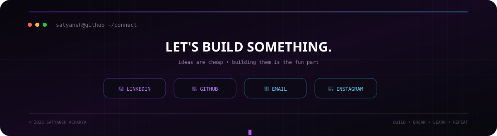

<div align="center">


</div>

<br>

<div align="center">

<a href="https://www.linkedin.com/in/satyansh-acharya/">

</a>
&nbsp;
<a href="mailto:acharyasatyansh@gmail.com">

</a>
&nbsp;
<a href="https://github.com/Spade-2006">

</a>
&nbsp;
<a href="https://instagram.com/__satyanshh">

</a>

</div>

<br>

<div align="center">


</div>

<br>

---

## 🧠 `whoami`

```text
Satyansh Acharya
├── 🎓 B.Tech CSE @ Lovely Professional University
├── 💻 Full-Stack Developer
├── ⚔️ DSA Enthusiast
├── 🏗️ Backend & Systems Explorer
├── 🤖 AI / RAG / Agentic AI
└── 🚀 Building things instead of just talking about them
```

I'm a Computer Science student who enjoys turning ideas into actual working systems.

My main interests sit somewhere between **full-stack development, backend engineering, DSA, system design and intelligent systems**.

I like projects that make me learn something new — whether that's building an RPG around algorithms, designing backend architectures, experimenting with AI systems, or making unnecessarily ambitious GitHub profiles.

---

<div align="center">


</div>

<br>

---

## ⚡ `tech.stack`

### 💻 Languages

<p>

</p>

### 🌐 Frontend

<p>

</p>

### ⚙️ Backend

<p>

</p>

### 🗄️ Databases

<p>

</p>

### ☁️ Tools & Infrastructure

<p>

</p>

### 🤖 AI / Emerging Tech

```text
RAG
Agentic AI
LLM APIs
GraphQL
Redis
AI-powered applications
```

---

## 🧩 `computer.science`

```text
DATA STRUCTURES & ALGORITHMS
├── Arrays
├── Linked Lists
├── Stacks & Queues
├── Trees
├── Graphs
├── Dynamic Programming
├── Greedy Algorithms
├── Searching & Sorting
└── Problem Solving

CORE CS
├── OOP
├── DBMS
├── Operating Systems
├── Computer Networks
└── Computer Architecture

SOFTWARE ENGINEERING
├── LLD
├── System Design
├── REST API Design
├── Database Design
└── Object-Oriented Design
```

---

## 🐍 `contribution.matrix`

<div align="center">


</div>

---

## 📊 `github.stats`

<div align="center">


</div>

<br>

<div align="center">


</div>

---

## 🏆 `achievements`

```text
550+       LeetCode Problems
1600       Peak Contest Rating
9.16       Current CGPA
150+       Curated DSA Problems
```

### 🎯 Competitive Programming

Focused on:

`DP` · `Graphs` · `Trees` · `Strings` · `Optimization` · `Complexity Analysis`

---

## 🚧 `currently.learning`

```text
┌──────────────────────────────────────────────┐
│                                              │
│   🧠 Advanced DSA & Problem Solving          │
│                                              │
│   🏗️ Backend Architecture                    │
│                                              │
│   📐 Low Level Design                        │
│                                              │
│   🌐 System Design                            │
│                                              │
│   🤖 RAG & Agentic AI                        │
│                                              │
│   🐳 Docker & Kubernetes                     │
│                                              │
│   ☁️ Cloud & Distributed Systems             │
│                                              │
└──────────────────────────────────────────────┘
```

---

## 🔬 `what.i.like.building`

<table>
<tr>
<td width="50%">

### 🧠 Intelligent Systems

AI applications that actually solve problems instead of just putting a chatbot in the corner.

</td>

<td width="50%">

### ⚙️ Backend Systems

APIs, databases, architecture, caching, authentication and everything behind the UI.

</td>
</tr>

<tr>
<td width="50%">

### 🎮 Experimental Projects

Games, visualizations and weird ideas that make learning more interactive.

</td>

<td width="50%">

### 📊 Data-Driven Products

Applications where the database isn't just sitting there looking pretty.

</td>
</tr>
</table>

---

## 📌 `featured.projects`

### ⚔️ AlgoVerse

**Story-driven DSA learning RPG**

> Learn Data Structures & Algorithms by actually living through them.

Players explore a game world, encounter algorithmic challenges, solve visual puzzles and eventually implement the underlying algorithm through integrated coding trials.

**Core loop**

```text
EXPLORE
   ↓
ENCOUNTER
   ↓
DISCOVER
   ↓
SOLVE
   ↓
CODE
   ↓
UNLOCK
```

🔗 **Repository:**  
https://github.com/Spade-2006/AlgoVerse

---

### 🧠 Disciplined-AF

**Personalized fitness & progress tracking**

A database-focused fitness tracking system built around workouts, progressive overload, cardio, steps, recovery and daily health metrics.

🔗 **Repository:**  
https://github.com/Spade-2006/Disciplined-AF

---

### 🚦 HillFlow AI

**Adaptive traffic decision system for hill cities**

A decision-support prototype designed around the unique traffic problems of hill-road networks such as narrow roads, bottlenecks, heavy vehicles and changing traffic conditions.

```text
MAP / TRAFFIC DATA
        ↓
PROCESSING
        ↓
LLM DECISION ENGINE
        ↓
TRAFFIC INSIGHT
        ↓
ACTIONABLE INTERVENTION
```

🔗 **Repository:**  
https://github.com/Spade-2006/HillFlow-AI

---

### 💼 Job Pulse

**Personal job-search operating system**

A planned platform for managing the entire job-search process — from discovering opportunities to tracking applications, analytics, reminders and interview preparation.

```text
Next.js
   ↓
NestJS
   ↓
PostgreSQL
   ↓
Prisma
```

🔗 **Repository:**  
https://github.com/Spade-2006/Job-Pulse

---

## 🎨 `outside.the.code`

```text
✏️ Anime Sketching
🗺️ Travel Sketching
♟️ Chess
📚 Reading
🎧 Music / Podcasts / Audiobooks
✈️ Travel
```

Sometimes I also disappear for a while and come back with another unnecessarily ambitious project.

---

## 📈 `activity`

<div align="center">


</div>

---

<div align="center">



</div>
