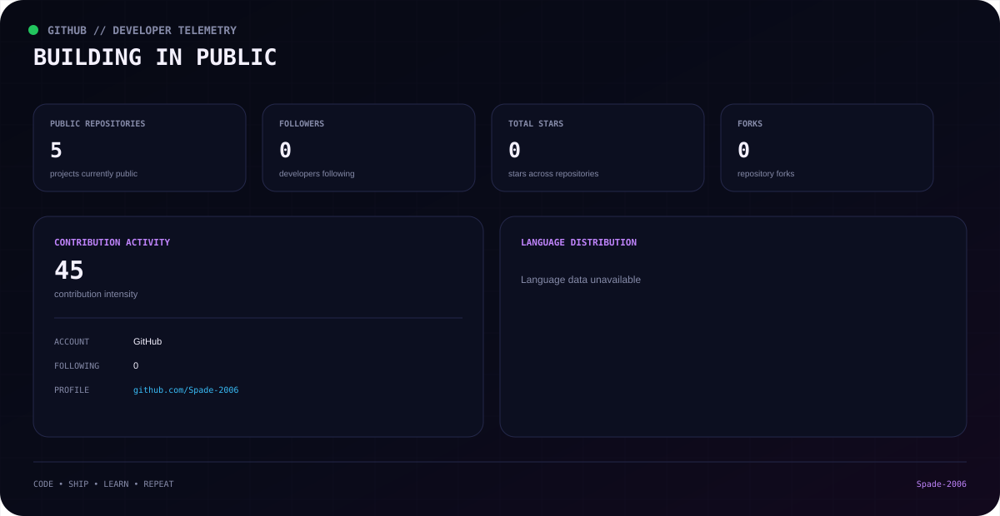
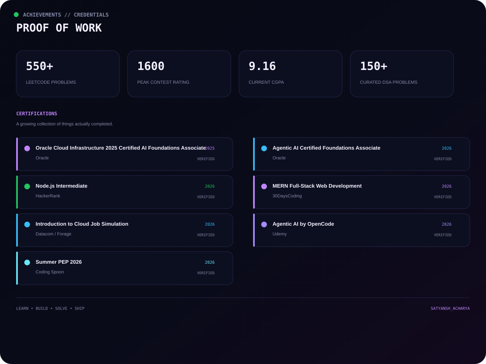
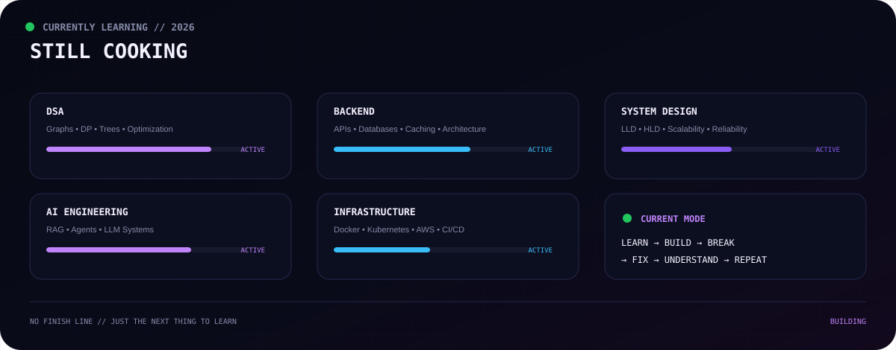
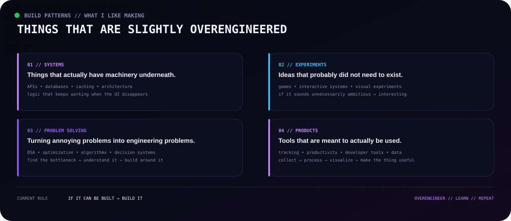
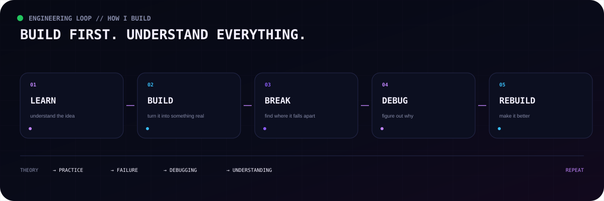
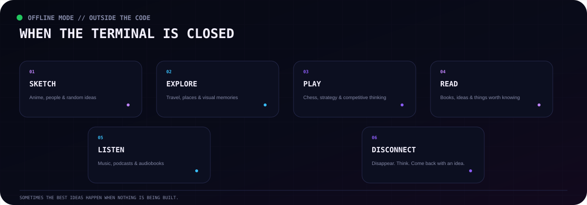

  

&nbsp;&nbsp;&nbsp;

&nbsp;&nbsp;&nbsp;

&nbsp;&nbsp;&nbsp;

 

 

---

## 🧬 `Who Am I?`

 

---

## ⚡ `Tech Fields`

 

---

## 🧩 `Computer Science`

 

---

## 🚀 `Things I Build`

 

---

## 🐍 `Contribution Snake`

<picture>
  <source
    media="(prefers-color-scheme: dark)"
    srcset="https://raw.githubusercontent.com/Spade-2006/Spade-2006/output/github-contribution-grid-snake-dark.svg"
  />
  <source
    media="(prefers-color-scheme: light)"
    srcset="https://raw.githubusercontent.com/Spade-2006/Spade-2006/output/github-contribution-grid-snake.svg"
  />
  
</picture>

 

---

## 📊 `Github Stats`

 

---

## 🏆 `Achievements`

 

---

## 📚 `Currently Learning`

 

---

## 🔬 `What I Like Building`

 

---

## 🧪 `Build Philosophy`

 

---

## 🎨 `Outside the Code`

 

---

