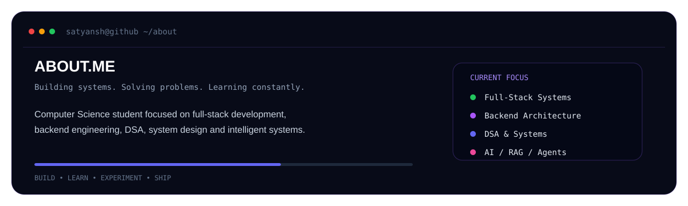
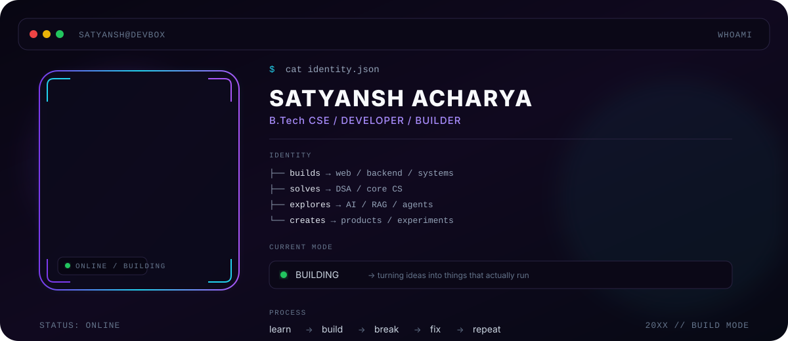
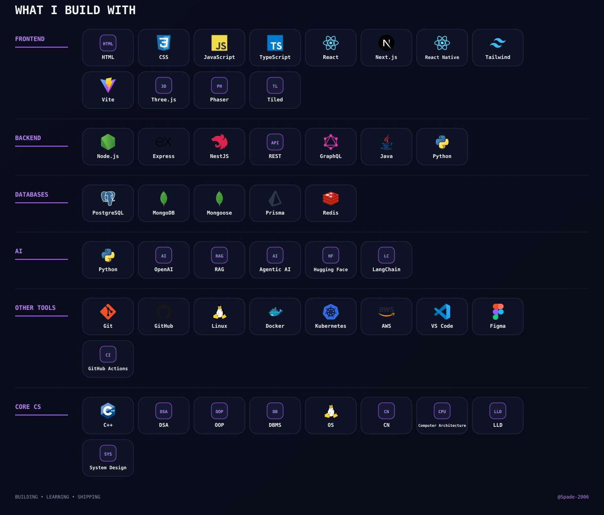
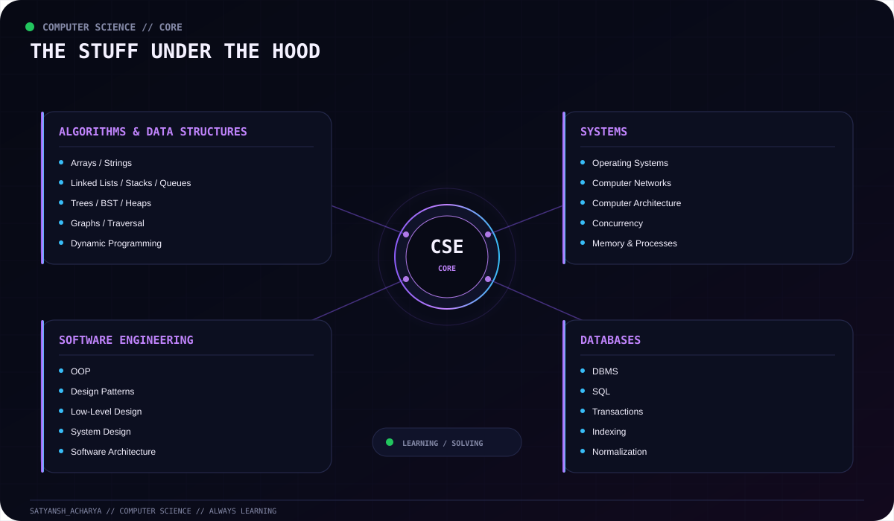
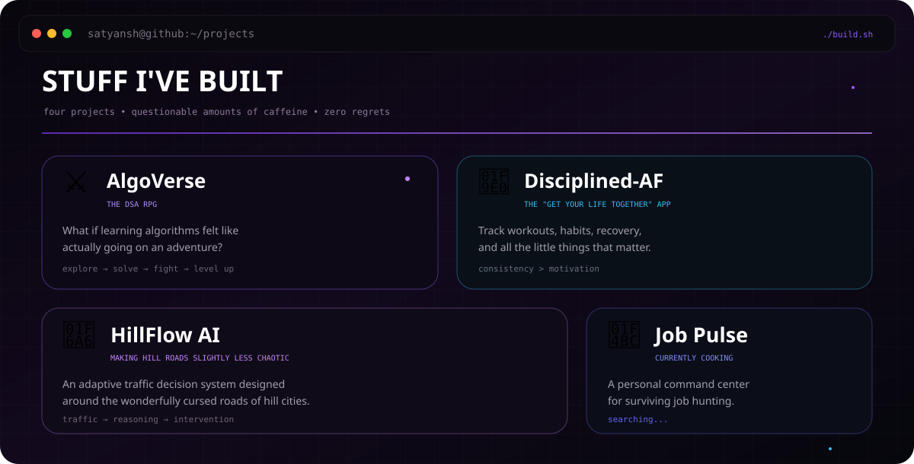

<div align="center">



<br><br>

<a href="https://www.linkedin.com/in/satyansh-acharya/">
  
</a>
&nbsp;&nbsp;&nbsp;
<a href="mailto:acharyasatyansh@gmail.com">

</a>
&nbsp;&nbsp;&nbsp;
<a href="https://github.com/Spade-2006">

</a>
&nbsp;&nbsp;&nbsp;
<a href="https://instagram.com/__satyanshh">

</a>

</div>

<br>

<div align="center">



</div>

<br>

---

## 🧬 `whoami`

<div align="center">



</div>

<br>

---

## ⚡ `tech.stack`

<div align="center">



</div>

<br>

---

## 🧩 `computer.science`

<div align="center">



</div>

<br>

---

## 🚀 `things.i.build`

<div align="center">



</div>

<br>

---

## 🐍 `contribution.matrix`

<div align="center">


</div>

<br>

---

## 📊 `github.stats`

<div align="center">


</div>

<br>

<div align="center">


</div>

<br>

---

## 🏆 `achievements`

<div align="center">

<table>
<tr>

<td align="center" width="25%">

### `550+`

LeetCode Problems

</td>

<td align="center" width="25%">

### `1600`

Peak Contest Rating

</td>

<td align="center" width="25%">

### `9.16`

Current CGPA

</td>

<td align="center" width="25%">

### `150+`

Curated DSA Problems

</td>

</tr>
</table>

</div>

<br>

### `competitive.programming`

```text
DP              GRAPHS              TREES
│                 │                   │
├─ optimization  ├─ traversal        ├─ BST
├─ states        ├─ shortest path    ├─ recursion
└─ transitions   └─ connectivity     └─ trees

STRINGS          SEARCH              COMPLEXITY
│                 │                   │
├─ patterns      ├─ binary search    ├─ Big-O
├─ matching      └─ optimization     ├─ tradeoffs
└─ manipulation                      └─ analysis
